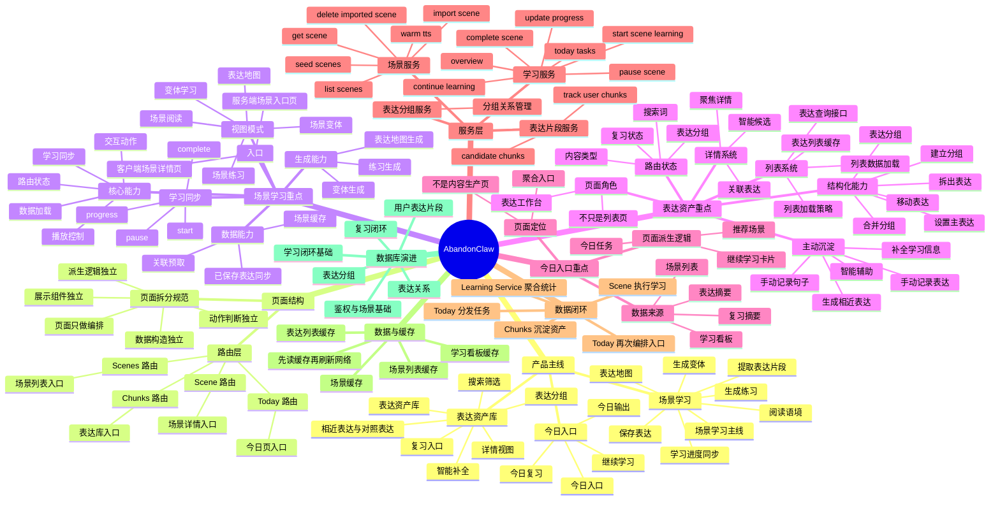

# AbandonClaw 项目思维导图

下面这份是 Mermaid 思维导图文本。支持 Mermaid 的编辑器里可以直接渲染；如果你要做 PPT，也可以基于这份结构继续精简。

## 适合做 PPT 的简化版主干

如果你想把思维导图压成 1 页 PPT，可以只保留这条主干：

1. `Today`：今日入口与任务编排
2. `Scene`：主学习流程与进度同步
3. `Chunks`：表达资产沉淀与结构化
4. `Service`：Scene / Learning / Cluster 三个后端核心服务
5. `Loop`：Today -> Scene -> Chunks -> Learning -> Today
