# AbandonClaw 项目树状讲解图

这份不是传统脑图，而是“树状层级图”。

这张图的顶层先放产品北极星，再展开实现机制，避免把页面链路误读成产品目标本身。

优点：

- 主次更清楚
- 更像组织结构图
- 适合讲项目时一层层展开
- 比 mindmap 更不容易糊成一团

```mermaid
flowchart TD
    A["AbandonClaw 项目"]

    A --> N["产品北极星"]
    A --> B["一、产品闭环"]
    A --> C["二、页面结构"]
    A --> D["三、核心服务"]
    A --> E["四、数据闭环"]
    A --> F["五、缓存与数据演进"]

    N --> N1["让每一次场景学习"]
    N --> N2["变成可复用的表达资产"]
    N --> N3["推进到能回忆、能说出口"]

    B --> B1["今日入口"]
    B --> B2["场景学习"]
    B --> B3["表达资产库"]

    B1 --> B11["继续学习"]
    B1 --> B12["今日复习"]
    B1 --> B13["今日输出"]

    B2 --> B21["阅读语境"]
    B2 --> B22["提取表达片段"]
    B2 --> B23["保存表达"]
    B2 --> B24["生成练习"]
    B2 --> B25["生成变体"]
    B2 --> B26["表达地图"]
    B2 --> B27["学习进度同步"]

    B3 --> B31["搜索筛选"]
    B3 --> B32["详情视图"]
    B3 --> B33["智能补全"]
    B3 --> B34["相近表达与对照表达"]
    B3 --> B35["表达分组"]
    B3 --> B36["复习入口"]

    C --> C1["今日页"]
    C --> C2["场景详情页"]
    C --> C3["表达库页"]
    C --> C4["场景列表页"]
    C --> C5["页面拆分规范"]

    C1 --> C11["聚合学习数据"]
    C1 --> C12["生成今日任务"]
    C1 --> C13["推荐继续学习"]

    C2 --> C21["数据加载"]
    C2 --> C22["交互动作"]
    C2 --> C23["路由状态"]
    C2 --> C24["播放控制"]
    C2 --> C25["学习同步"]
    C2 --> C26["多视图切换"]

    C26 --> C261["场景阅读"]
    C26 --> C262["场景练习"]
    C26 --> C263["场景变体"]
    C26 --> C264["变体学习"]
    C26 --> C265["表达地图"]

    C3 --> C31["列表加载"]
    C3 --> C32["筛选状态"]
    C3 --> C33["表达详情"]
    C3 --> C34["表达分组管理"]
    C3 --> C35["手动记录与智能辅助"]

    C5 --> C51["页面只做编排"]
    C5 --> C52["派生逻辑独立"]
    C5 --> C53["动作判断独立"]
    C5 --> C54["数据构造独立"]
    C5 --> C55["展示组件独立"]

    D --> D1["场景服务"]
    D --> D2["学习服务"]
    D --> D3["表达片段服务"]
    D --> D4["表达分组服务"]

    D1 --> D11["场景初始化"]
    D1 --> D12["场景列表与详情"]
    D1 --> D13["导入场景"]
    D1 --> D14["删除导入场景"]
    D1 --> D15["场景语音预热"]

    D2 --> D21["开始学习"]
    D2 --> D22["更新进度"]
    D2 --> D23["完成学习"]
    D2 --> D24["暂停学习"]
    D2 --> D25["学习看板聚合"]
    D2 --> D26["今日任务聚合"]

    D3 --> D31["记录表达片段行为"]
    D3 --> D32["生成候选表达片段"]

    D4 --> D41["建立分组"]
    D4 --> D42["合并分组"]
    D4 --> D43["移动表达"]
    D4 --> D44["拆出表达"]
    D4 --> D45["设置主表达"]

    E --> E1["今日入口分发任务"]
    E --> E2["场景页执行主学习"]
    E --> E3["表达库沉淀资产"]
    E --> E4["学习服务聚合统计"]
    E --> E5["再次回流今日入口"]

    F --> F1["场景缓存"]
    F --> F2["场景列表缓存"]
    F --> F3["表达列表缓存"]
    F --> F4["学习看板缓存"]
    F --> F5["先读缓存再刷新网络"]
    F --> F6["数据库阶段演进"]

    F6 --> F61["鉴权与场景基础"]
    F6 --> F62["学习闭环基础"]
    F6 --> F63["用户表达片段"]
    F6 --> F64["复习闭环"]
    F6 --> F65["表达关系"]
    F6 --> F66["表达分组"]
```

## 推荐用法

如果你要讲项目，我建议优先用这份树状图，而不是 mindmap。

推荐讲法：

1. 先讲第一层：产品闭环、页面结构、核心服务
2. 再展开第二层：`今日入口`、`场景学习`、`表达资产库`
3. 最后展开最细层：比如“场景页为什么复杂”“表达库为什么是资产层”

## 如果你还想更清楚

我还可以继续给你拆成 3 张单独的树图：

- 一张只讲产品闭环
- 一张只讲 `scene`
- 一张只讲 `chunks`

那样会比这一张总图更清楚，也更适合 PPT。
